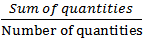
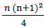

<h1>🪵 Average</h1>
<h3>Aptitude Concepts and Formulas</h3>

 

## [ ❓ Click Here for Questions](Question.md)

## 📖 CONCEPTS

1. The average of n quantities of the same kind is equal to the sum of all the quantities divided by the number of quantities;

   - `Average` =

     

   - `Sum of quantities` = Average ∗ Number of quantities
   - `Number of quantities` =

     

2. Average of two or more than two groups;
   If the number of quantities in two groups are n1 and n2 respectively and their individual average is X and Y respectively, the combined average of the two groups is given by;

   

3. If the average of n1 quantities is X and the average of n2 quantities out of n1 quantities is Y, the average of the remaining quantities is given by;

   

4. The average of n quantities is equal to X. One quantity of value P is replaced with a new quantity having value Q the average of quantities becomes Y. Then Q is given by;

   Q = P+n (Y-X)

5. The average of n quantities is equal to X. If we remove one quantity the average becomes Y, the value of the removed quantity is given by;

   = n(X - Y) + Y

- And, if the average of n quantities is equal to X and on adding a new quantity the average becomes Y, the value of new quantity is given by;

  = n(Y - X) + Y

## Average of numbers:

- `Natural numbers:`

  - The average of first n consecutive natural numbers is given by;

    

  - The average of square of first n consecutive natural numbers is given by;

    

  - The average of cubes of first n consecutive natural numbers is given by;

    

- `Even numbers:`

  - The average of first n consecutive even numbers is given by;

    = n + 1

  - Also, the average of first n consecutive even numbers starting from 2 to X, where the last even number is X, is given by;

    

  - The average of square of first n consecutive even numbers is given by;

    

  - Also, the average of square of first n consecutive even numbers starting from 2 to X, where the last even number is X, is given by;

    

- `Odd numbers:`

  - The average of first n consecutive odd numbers is equal to n.

  - Also, the average of first n consecutive odd numbers starting from 1 to X, where the last odd number is X is given by;

    

  - The average of square of first n consecutive odd numbers starting from 1 to X, where the last odd number is X, is given by;

    

## Some quicker methods:

- The average of n numbers is X. If each number is multiplied by Y, the new average is given by;

  = Initial average ∗ Y

- The average age of a group of boys is given. If the new average age after a boy joins the group is also given, the age of new boy is given by;

  - `Age of new boy` = New average + number of boys initially ∗ increase in average

- The average weight of a group of persons is given. If we replace a person in the group with another person and the new average is increased,

  - `The weight of new person` = weight of the removed person + no. of persons ∗ increase in average.

- The average of the marks obtained by students is given. The average of marks obtained by the passed students and failed students are also given, then

  - `Number of passed candidates`

    

  - `And, Number of failed students`

    

 

  HAPPY 😊 LEARNING !! 
  DEVELOPED WITH ❤️ BY SNEH KR 

