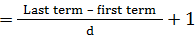

<h1>🔢 Number</h1>
<h3>Aptitude Concepts and Formulas</h3>

 

## [ ❓ Click Here for Questions](Question.md)

## 📖 CONCEPTS

1. `Natural numbers:` The counting numbers which are used for counting are known as natural numbers, i.e. 1,2,3,4,5,6,7,8, and 9. These figures are known as digits. The natural numbers are denoted by 'N'. 0 is known as insignificant digit and other digits are known as significant digits.

2. `Whole numbers:` On including '0' in the natural numbers we get the whole numbers, i.e. 0,1,2,3,4,5,6,7,8,9. The whole numbers are positive numbers. They do not include any fractional or decimal part and are denoted by 'W'.

3. `Integers:` The whole numbers including the negative numbers and excluding fractions are known as integers, e.g. -5,-4,-3,-2,-1,0,1,2,3,4,5. So, integers can be positive(1,2,3,4,5), negative(-5,-4,-3,-2,-1) or zero(0).

4. `Prime numbers:` A whole number which is greater than 1 and is divisible by 1 and itself is a prime number, e.g. 2,3,5,7,11.

5. `Co-prime numbers:` Two natural numbers p and q are said to be co-prime if their H.C.F. is 1, e.g. (2, 3) (4, 5) (7, 9) (11, 9).

6. `Composite number:` It refers to a whole number which is greater than 1 and is not a prime number.It can be divided by numbers other than 1 and itself e.g. 4,6,8,9,10,12.

7. `Even number:` An integer which is divisible by 2 is known as an even number e.g. 2,4,6,8.

8. `Odd number:` An integer which is not divisible by 2 is know as an odd number e.g. 1,3,5,7,9.

9. `Consecutive numbers:` It is a series of numbers in which the numbers follow each other in an order, i.e. there is a difference of 1 between two successive numbers or each number is greater than the preceding number by 1.

10. `Rational number:` The numbers in the form of p/q where p and q are integers and q can?t be zero are known as rational numbers, e.g., 22/7, 5/3, 0/11, -143/15.

11. `Irrational numbers:` The numbers which when written in decimal form do not terminate and repeat are known as irrational numbers. These numbers cannot be expressed as a ratio of integers or as a fraction, e.g.√2,√3,√5, π, etc.

12. `Real Numbers:` The numbers which can be found on the number line and include both rational and irrational numbers are known as real numbers, e.g. -1.5,√2,0,1,2,3,π.Almost any number which you can imagine is a real number.

13. `Face value:` It is the actual value of a digit. It remains definite and does not change with the digit's place, e.g. in the numbers 435 and 454, the digit 5 has a face value of 5.

14. `Place value:` The place value of a digit depends on its place or position in the number. It is the product of its place and face value. Each place in a number has a value of 10 times the place to its right, e.g. in a number 567, the digit 7 is in the ones place, digit 6 is in tens place and digit 5 is in hundreds place and the place value of 7 is 7*100 = 7, the place value of 6 is 6* 101 = 60 and place value of 5 is 5 \* 102 = 500.

15. `Unit digit:` The unit digit is the ones place digit of a number.

## Rule for 0, 1, 5, and 6:

- The integers that end in digits 0, 1, 5, and 6 have the same unit digit, e.g. 0,1,5,6 respectively, irrespective of the positive integer exponent.

- For example: The unit digit of 156^4 = 6
- Similarly, the unit digit of 131^1783663797 = 1

## Rule for integer that end in 4:

- The unit digit of 4^1= 4
- The unit digit of 4^2 = 16
- The unit digit of 4^3 = 64
- The unit digit of 4^4 = 256

- It shows if the power of 4 is even, the unit digit is 6, and if the power is an odd number, the unit digit is 4.

## Rule for 9:

- The unit digit of 9^1 = 9
- The unit digit of 9^2 = 81
- The unit digit of 9^3 = 729
- The unit digit of 9^4= 6561

- It shows if the power of 9 is even, the unit digit is 1, and if the power is an odd number, the unit digit is 9.

## Rule for 2, 3, 7, and 8:

- These numbers have a power cycle of 4 different numbers as show below:

- The unit digit of 2^1 =2
- The unit digit of 2^2 =4
- The unit digit of 2^3 = 8
- The unit digit of 2^4 = 16
- The unit digit of 2^5 = 32
- The unit digit of 2^6 = 64
- The unit digit of 2^7 = 128
- The unit digit of 2^8 = 256

- It follows a pattern: 2,4,8,6, 2,4,8,6 and so on.

- So, the possible unit digit of 2 has 4 different numbers 2, 4, 8, and 6.

## Similarly:

- The unit digit of 3^1 =3
- The unit digit of 3^2 =9
- The unit digit of 3^3 = 27
- The unit digit of 3^4 = 81
- The unit digit of 3^5 = 243
- The unit digit of 3^6 =729
- The unit digit of 3^7 = 2187
- The unit digit of 3^8 = 6561

- It follows a pattern: 3, 9, 7, 1, 3, 9, 7,1and so on.

- So, the possible unit digit of 3 has 4 different numbers 3, 9, 7, and 1.

- Same logic for 7 and 8: The numbers have 4 possible different numbers as their possible unit digits. The 7 has 7, 9, 3, 1 and 8 has 8, 4, 2, 6 respectively.

## Notes:

1. The number 1 is not a prime or composite number.

2. The number 2 is the only even number which is a prime number.

3. There are 25 prime numbers between 1 and 100, e.g.

   - 2,3,5,7,11,13,17,19,23,29,31,37,41,43,47,53,59,61,67,71,73,79,83,89 and 97.

## How to find whether a given number is prime or not;

- Select the least positive integer 'n' so that n2 > given number.
- Find out all the prime numbers less than n and check if the given number is divisible by any of these prime numbers.
- If the given number is not divisible by any of the prime numbers, it will be a prime number. See the example given below;

## Is 823 a prime number?

- As (28)^2 = 784 and 784<823 so we will not consider 28.

- (29)^2 = 841<823, so n = 29

- Prime numbers less than 29 are 2, 3, 5, 7, 11, 13, 17, 19, 23

- We find that 823 is not divisible by any of these prime numbers so it is a prime number.

## Tests for divisibility or divisibility rules:

- `Divisibility by 2:` A number is divisible by 2 if its last digit or unit digit is 0 or divisible by 2, e.g. 150, 224, 436

- `Divisibility by 3:` A number is divisible by 3 if the sum of its digits is divisible by 3, e.g. 246

- `Divisibility by 4:` A number is divisible by 4 if the number formed by its last two digits is divisible by 4, or the number has two or more zeros at the end, e.g. 516 as 16 is divisible by 4, and 15800 having 00 at the end is also divisible by 4.

- `Divisibility by 5:` A number is divisible by 5 if its last digit is either 0 or 5, e.g. 500 and 505.

- `Divisibility by 6:` A number is divisible by 6 if it is divisible by 2 and 3, e.g. 114

- `Divisibility by 8:` A number is divisible by 8 if the number formed by its last three digits is divisible by 8, e.g. 1200

- `Divisibility by 9:` A number is divisible by 9 if the sum of its digits is divisible by 9, e.g. 117

- `Divisibility by 10:` A number is divisible by 10 if its last digit is 0, e.g. 230

- `Divisibility by 12:` A number is divisible by 12 if it is divisible by 3 and 4, e.g. 264

- `Divisibility by 25:` A number is divisible by 25 if its last two digits are zero or the number formed by its last two digits is divisible by 25, e.g. 300 and 325.

## Some Important Formulae:

- (a+b)^2 = a^2 + b^2 + 2ab

- (a - b)^2 = a^2 + b^2 - 2ab

- (a+b)^2 - (a - b)^2 = 4ab

- (a+b)^2 + (a - b)^2 = 2 (a^2 + b^2 )

- (a^2 - b^2) = (a - b) (a+b)

- (a^3 + b^3) = (a+b) (a^2 - ab + b^2)

- a^3- b^3 = (a - b) (a^2 + ab + b^2)

- a.( b + c) = ab + ac

- a.( b - c) = ab - ac

- (a+b)^3 = a^3 + b^3 + 3ab (a+b)

- (a - b)^3 = a^3 - b^3 - 3ab (a - b)

## Quick multiplicatoin methods :

1. Multiplying a number by 9, 99, 999, 9999 or 10n - 1: Put as many zeros to the right of the multiplicand as there are nines in the multiplier then subtract the multiplicand from the result. See the example given below;

   a. 2789 \* 99 = ?

   2789 (multiplicand) x 99 (multiplier) = 278900-2789 = 276111

   b. 234 \* 999 = 234000 - 234 = 233766

2. Multiplying a number by 11, 101, 1001, 10001 or 10n +1: Place 'n' zeros to the right of multiplicand then add the multiplicand to it to get the answer.See the example given below;

   a. 234 \* 11 (101 + 1)= 2340 + 234 = 2574

   b. 234 \* 101 (102 + 1)= 23400 + 234 = 23634

3. Multiplying a number by 5, 25, 125, 625 or by a number which is some power of 5: Place as many zeros to the right of the multiplicand equal to the power of 5 in the multiplier then divide it by 2 raised to the power of 5. See the examples given below;

   
   

## Some quicker methods:

- A number when divided by d1 and d2 leaves the remainders r1 and r2 respectively. If the number is divided by d1 \* d2 then the remainder is given by;

  = (d1\* r2+r1)

- Two numbers when divided by a given divisor leaves remainders r1 and r2. If the sum of the numbers is divided by the same divisor the remainder is r3. Then the divisor is given by;

  = r1 + r2 - r3

- If the sum and difference of two numbers (x and y) is given, then their product is given by;

  

- And, the two numbers are given by;

  

## How to find the number of numbers divisible by a given integer:

- Let us understand it with an example; find the number of numbers up to 432 which are divisible by 15.

- Method: Divide 432 by 15.

  = 432 = 28 (quotient) \* 15 + 12

- The quotient obtained is the required number of numbers up to 432 which are divisible by 15.

## Basic rules of counting numbers:

- The sum of first n natural numbers is given by;

  

- The sum of first n odd numbers is given by;

  Sum = n2

- The sum of first n even numbers is given by;

  Sum = n (n+1)

- The sum of squares of first n natural numbers is given by;

  

- The sum of cubes of first n natural numbers is given by;

  

## Progression:

- It refers to a sequence of numbers that advances in a logical pattern, e.g. arithmetic progression and geometric progession, etc.

## Arithmetic progression:

- It is a sequence of numbers in which the difference between any two successive numbers remains constant, e.g. the series 1,2,3,4.., 3,5,7,9.. and 5,10,15,20...

- The first term in an arithmatic progression is denoted by 'a' , nth term is denoted by Tn , common difference is denoted by 'd' and the sum of the first n numbers is denoted by 'S^n' , e.g. in an arithmetic sequence 1,2,3,4,5, a = 1, d= 2-1=1, and T3 = 3.

- Therefore, an Arithmetic progression with first term 'a' and common difference d is given by;

  a, (a+d), (a+2d), (a+3d),

- The nth term of an arithmetic progression is given by;

  Tn = a + (n-1)d

- The sum of first n terms of an arithmetic progression is given by;

  

- The number of terms in an arithmetic progression is given by;

  

## Geometric progression:

- It is a sequence of numbers in which each number is found by multiplying the previous number by a fixed number or a common ratio.

- The first term in an geometric progression is denoted by 'a' , nth term is denoted by Tn , common ratio is denoted by 'r' and sum of the first n numbers is denoted by 'S^n' , e.g. in a geometric sequence 3,9,27,81, a = 3, r = 9/3 or 3, and T3 = 27.

- Therefore, a geometric progression with first term 'a' and common ratio 'r' is given by;

  a, ar, ar^2,ar^3,-

- The nth term of a geometric progression is given by;

  = ar^n-1

- The sum of first n terms in a geometric progression is given by;

  

 

  HAPPY 😊 LEARNING !! 
  DEVELOPED WITH ❤️ BY SNEH KR 

